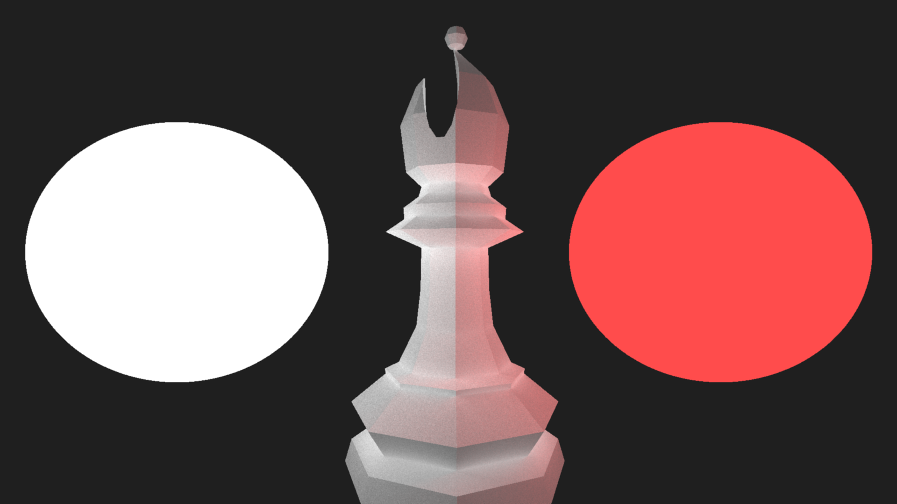
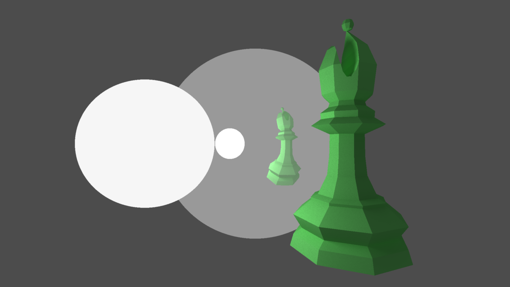
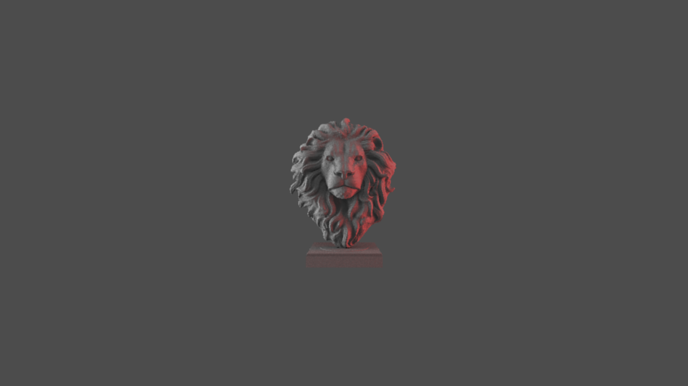
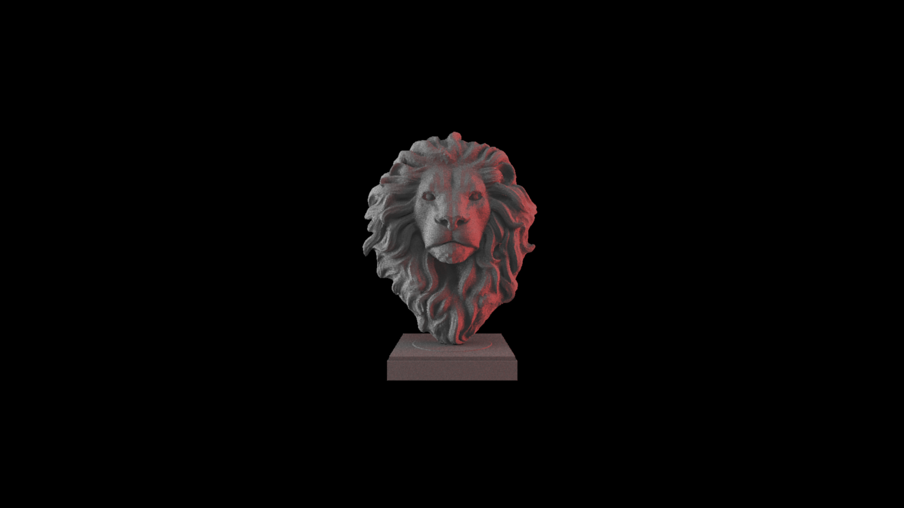

# any-car-grit

21.6 seconds without AABB (axis aligned bounding box) test, 20 seconds with AABB testing

835 seconds

18 seconds, 30 rays per pixel

1min26, 150 rays per pixel

11min30, 1200 rays per pixel

33min, 1500 rays per pixel, 1080p

8min20, 10 000 rays per pixel

20min, 5 000 rays per pixel, 1080p, with basic BVH

31min, 6 000 rays per pixel, 1080p (then 16min)

18min, 200 rays per pixel (just for the record)

43min, 600 rays per pixel

45min, 600 rays per pixel

1h, 200 rays per pixel, 1080p

1h, 1200 rays per pixel, 0.3 triangles, 1080p